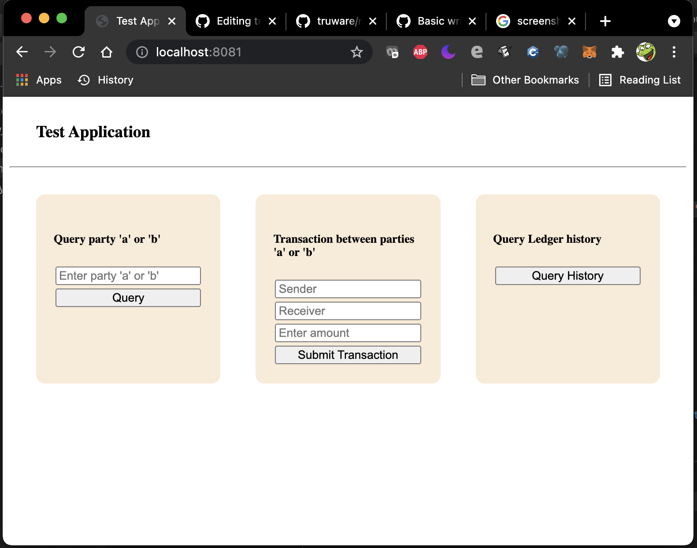

# Test application

It demonstrates the complete integration of 
- Hyledger Fabric network
- Simple chaincode
- Go client sdk
- HTML test application

# Running the test application
Steps
- Run the default network. ```./minifab up -o admin.truware.com -e true```
 [More Details](https://github.com/Anil8753/truware/tree/main/network)
 
- Build and run the Go app
  ```
  go mod vendor
  go build
  ./truware
  ```

- Open http://localhost:8081/ in the web browser

  <br/>
  
  
